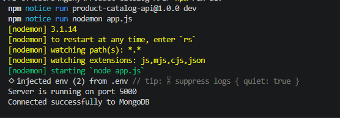
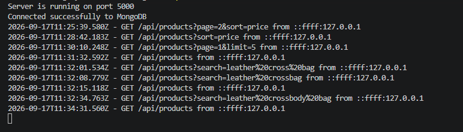
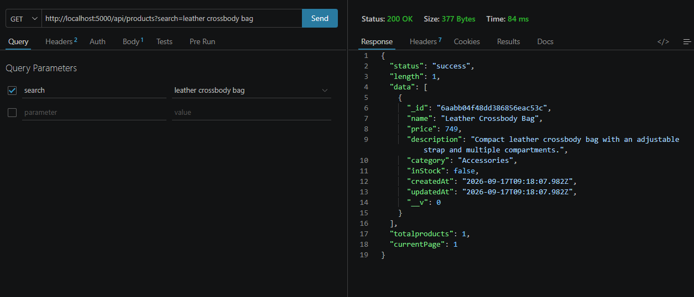
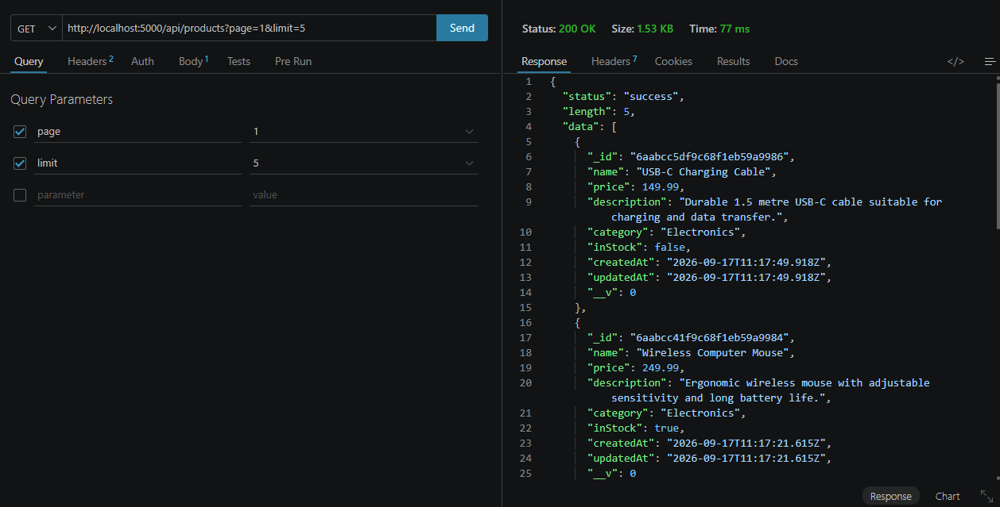
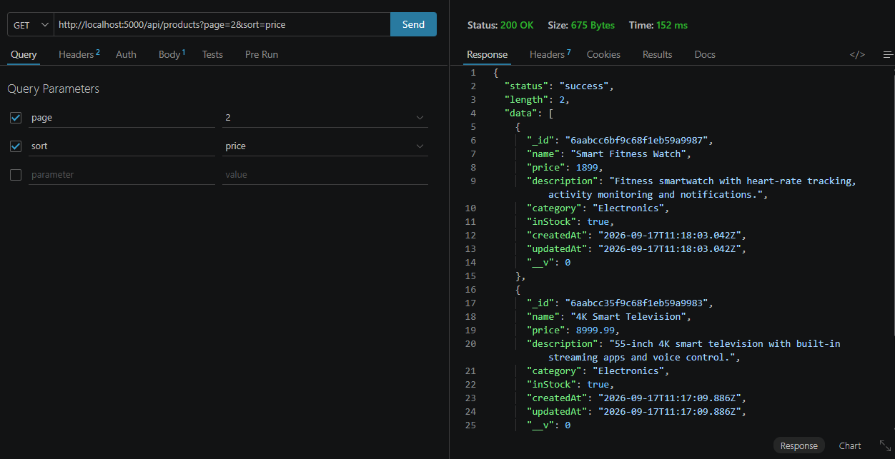

# Product Catalog API

A RESTful API for managing products using **Node.js, Express, MongoDB, Mongoose, and Joi**.

The API supports creating, retrieving, updating, and deleting products, as well as advanced features such as searching, sorting, and paginating products.

---

## Features

- Create a product
- Get all products
- Search products by name
- Sort products by price
- Paginate products
- Get a product by ID
- Update a product
- Delete a product
- Validate product data using Joi
- Store product data in MongoDB
- Centralized error handling
- Request logging

---

## Technologies Used

| Technology | Purpose |
|---|---|
| Node.js | JavaScript runtime |
| Express.js | Web framework for building the API |
| MongoDB | Database |
| Mongoose | MongoDB object modeling |
| Joi | Request data validation |
| Nodemon | Automatically restarts the server during development |
| dotenv | Loads environment variables |

---

## Project Structure

```text
Product-Catalog-API/
│
├── controllers/
│   └── product.controller.js
│
├── database/
│   └── connectDB.js
│
├── images/
│
├── middlewares/
│   ├── errorHandler.js
│   └── logger.js
│
├── models/
│   └── product.model.js
│
├── routes/
│   └── product.routes.js
│
├── validation/
│   └── product.validation.js
│
├── .env
├── .gitignore
├── app.js
├── package.json
├── package-lock.json
└── README.md
```
---
## MongoDB Database Connection

The application uses MongoDB as the database and Mongoose to manage the connection and interact with the database.

When the application starts successfully, the database connection is established before the API handles requests.



---

## API Endpoints

| Method | Endpoint | Description |
|---|---|---|
| POST | `/api/products` | Create a new product |
| GET | `/api/products` | Get all products |
| GET | `/api/products/:id` | Get a product by ID |
| PUT | `/api/products/:id` | Update a product by ID |
| DELETE | `/api/products/:id` | Delete a product by ID|

---

## Logging

The API uses custom request-logging middleware to log incoming HTTP requests, including the HTTP method, request path.



---

### Advanced Query Parameters

The `GET /products` endpoint supports:

| Parameter | Description | Example |
|---|---|---|
| `search` | Search products by name | `?search=laptop` |
| `sort` | Sort products by price in ascending order | `?sort=price` |
| `page` | Select page number | `?page=2` |
| `limit` | Number of products per page | `?limit=5` |


---

### GET /products?sort=price


### GET /products?search=name



### GET /products?page=1&limit=5



### GET /products?page=2&sort=price

